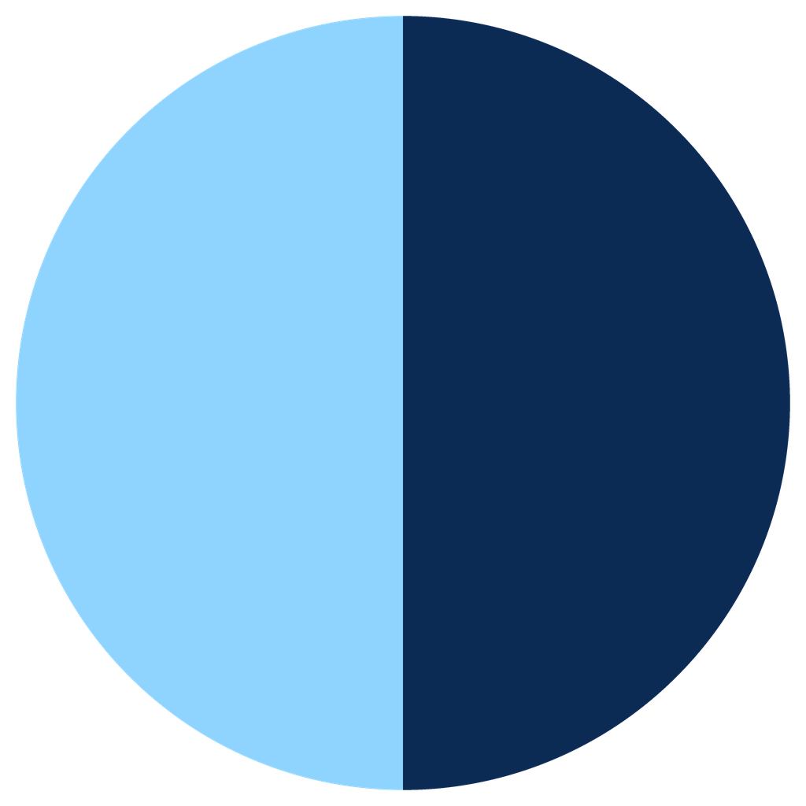

<!-- pr:begin header -->


# DocsConnect
> Grasshopper plugin for the Google Docs REST API — by Eesha Jain
>
> Built with the [PleaseREST](https://github.com/eesha-on-jupiter/PleaseREST) Claude Code plugin — an AI pipeline that turns a REST API reference into a Grasshopper plugin.

Author, populate and restructure Google Docs from a Grasshopper canvas: build the content as self-indexed request blocks (text, headings, bullets, images, tables), place them in order with one aggregator, and push the whole thing to a live document in a single `batchUpdate` call.

<br clear="left">

## What you can do with it

Write project documentation straight from the model, and regenerate it whenever the design changes:

- **Design and study reports** — headings, paragraphs and bullet lists generated from the definition, so the write-up updates with the geometry.
- **Rhino views in the document** — capture named viewports and place them in the report, one per line, with captions.
- **Schedules and results tables** — a Grasshopper data tree (areas, quantities, member sizes, analysis results) becomes a Docs table; cells can be coloured by value for pass/fail or gradient checks.
- **Project header, footer and page setup** — project name, number, date, revision, margins and page size, in the same run.
- **Living documents** — clear and rebuild the document on every run, append below what is already there, or swap an image or phrase in place.

Component chains for each of these are in [docs/workflows.md](docs/workflows.md); a worked tower-study report is in [docs/examples/](docs/examples/).

**Under the hood**

- No index bookkeeping — every block places itself; **Request Aggregator** resolves real positions, in wire or Merge order.
- Style chaining — any Text/Paragraph component layers its trait onto the block wired into it, so one piece of text can carry several styles.
- One `batchUpdate` per click — every write is a button; nothing hits a live document on canvas recompute.
<!-- pr:end header -->

<!-- pr:begin install -->
## Installation

**Food4Rhino:** (pending first release)
**Yak:** `_PackageManager` → search `docsconnect` (pending first release)

**Rhino 8 note:** the Rhino 8 packages are built for .NET 7 and load only when Rhino runs on the .NET Core runtime (its default). If the DocsConnect tab is missing, run `SetDotNetRuntime` in Rhino, choose **.NET Core**, and restart — Rhino.Inside Revit setups often switch this to .NET Framework.

**From source:** `dotnet build DocsConnect.csproj`, then drop the `.gha` for your Rhino version into Grasshopper's `Libraries` folder (Rhino 7: `bin/Debug/net48`; Rhino 8 Windows: `bin/Debug/net7.0-windows`; Rhino 8 Mac: `bin/Debug/net7.0`) and restart Rhino — or point Grasshopper's developer-folder setting at the build folder. Close Rhino before rebuilding; it locks the `.gha`.
<!-- pr:end install -->

<!-- pr:begin quickstart -->
## Quick start

1. Get an OAuth 2.0 access token from the [Google OAuth Playground](https://developers.google.com/oauthplayground/) with the `https://www.googleapis.com/auth/documents` scope (add `drive.file` to host images, `drive.readonly` to look documents up by name). See [docs/authentication.md](docs/authentication.md).
2. Drop **Auth** (Connect tab) and plug the token into `Token` — `Status` reports the granted scopes.
3. **Create Document** (Document tab) with a title → `Document ID`.
4. Author content: **Heading Text**, **Insert Text**, **Bullet List**, **Insert Image**, **Data Tree To Table**… each emits `Request JSON` with no index to manage.
5. Wire every block into **Request Aggregator** (Combine tab), one wire each or through a Merge, in reading order.
6. **Batch Update** with the token, the Document ID and the aggregator's `Requests JSON` — click the button.

Full walkthrough: [docs/quickstart.md](docs/quickstart.md). Common wirings as component chains: [docs/workflows.md](docs/workflows.md). Reference for every component: [docs/index.md](docs/index.md).
<!-- pr:end quickstart -->

<!-- pr:begin components -->
## Components

| Tab | Component | Inputs | Outputs | Description |
|---|---|---|---|---|
| Connect | Connect | Token | Status, Response | Validates one or more Google OAuth access tokens via Google tokeninfo and reports the granted scopes for each. |
| Document | Batch Update | Token, Document ID, Requests JSON | Status, Response | Applies a list of batchUpdate requests to one or more existing Google Docs. |
| Document | Clear Document | Token, Document ID | Status, Response | Deletes all content from one or more documents. |
| Document | Create Document | Token, Title | Status, Response, Document ID | Creates one or more new blank Google Docs with the given titles. |
| Document | Create Footer | Token, Document ID, Text | Status, Response, Footer ID | Creates a document footer in one or more documents. |
| Document | Create Footnote | Token, Document ID, Text | Status, Response, Footnote ID | Creates one or more footnote references, appended at the end of each document's body. |
| Document | Create Header | Token, Document ID, Text | Status, Response, Header ID | Creates a document header in one or more documents. |
| Document | Get Document | Token, Document ID, Name | Status, Response, Title, Document ID, End Index | Retrieves one or more Google Docs by document ID, or finds them by name (via the Drive API), and returns the resolved Document ID, raw JSON and title. |
| Document | Update Document Style | Margin Top, Margin Bottom, Margin Left, Margin Right, Page Width, Page Height, Background | Request JSON | Builds an updateDocumentStyle request; only supplied properties are applied. |
| Text | Baseline Text | Text, Baseline, Segment ID | Request JSON | Inserts one or more lines of text with a baseline offset (SUPERSCRIPT or SUBSCRIPT). |
| Text | Bold Text | Text, Segment ID | Request JSON | Inserts one or more lines of text and makes them bold. |
| Text | Font Family Text | Text, Font Family, Segment ID | Request JSON | Inserts one or more lines of text in a given font family. |
| Text | Font Size Text | Text, Font Size, Segment ID | Request JSON | Inserts one or more lines of text at a given font size. |
| Text | Highlight Text | Text, Highlight, Segment ID | Request JSON | Inserts one or more lines of text with a given highlight color. |
| Text | Insert Text | Text, Segment ID | Request JSON | Builds an insertText request for one or more lines of text. |
| Text | Italic Text | Text, Segment ID | Request JSON | Inserts one or more lines of text and makes them italic. |
| Text | Link Text | Text, URL, Segment ID | Request JSON | Inserts one or more lines of text as hyperlinks. |
| Text | Replace All Text | Find, Replace, Match Case | Request JSON | Builds a replaceAllText request per Find/Replace pair, replacing every occurrence of each. |
| Text | Strikethrough Text | Text, Segment ID | Request JSON | Inserts one or more lines of text and strikes them through. |
| Text | Styled Text | Text, Bold, Italic, Underline, Strikethrough, Font Size, Font Family, Text Color, Highlight, Link URL, Baseline, Segment ID, Same Paragraph, Separator | Request JSON | Inserts text with any combination of styles applied — bold, italic, underline, strikethrough, size, font, color, highlight, link, baseline. |
| Text | Text Color | Text, Color, Segment ID | Request JSON | Inserts one or more lines of text, each in a given foreground color. |
| Text | Underline Text | Text, Segment ID | Request JSON | Inserts one or more lines of text and underlines them. |
| Paragraph | Aligned Text | Text, Alignment, Segment ID | Request JSON | Inserts one or more paragraphs with a given alignment. |
| Paragraph | Bullet Item Text | Text, Bullet Preset, Segment ID | Request JSON | Inserts one or more bulleted lines of text using a bullet preset. |
| Paragraph | Bullet List | Items, Indent Levels, Bullet Preset | Request JSON | Builds the requests for a bulleted, numbered or checkbox list from a list of strings. |
| Paragraph | Heading Text | Text, Named Style, Segment ID | Request JSON | Inserts one or more paragraphs styled with a named heading. |
| Paragraph | Indent Text | Text, Indent, Segment ID | Request JSON | Inserts one or more paragraphs with a given start indent. |
| Paragraph | Line Spacing Text | Text, Line Spacing, Segment ID | Request JSON | Inserts one or more paragraphs with a given line spacing. |
| Paragraph | Report Header Block | Project Name, Project Number, Date, Author, Revision, Layout | Request JSON | Builds a project title block: name (TITLE) plus project number, date, author and revision. |
| Paragraph | Report Skeleton | Title, Headings, Heading Levels, Bodies | Request JSON | Builds a titled report scaffold: title plus per-section styled heading and body paragraphs. |
| Paragraph | Space Above Text | Text, Space Above, Segment ID | Request JSON | Inserts one or more paragraphs with given space above. |
| Paragraph | Space Below Text | Text, Space Below, Segment ID | Request JSON | Inserts one or more paragraphs with given space below. |
| Paragraph | Styled Paragraph | Text, Named Style, Alignment, Line Spacing, Indent, Space Above, Space Below, Segment ID | Request JSON | Inserts one or more paragraphs with any combination of paragraph-level styles applied — named style, alignment, line spacing, indent, space above/below. |
| Insert | Capture Rhino View | View Name, File Path, Width, Height | File Path | Captures the active (or named) Rhino viewport to a PNG file and outputs its file path. |
| Insert | Get Image URL | Token, Bitmap, File Path, URL | Image URL | Resolves an image to a public URL usable by Insert Image / Replace Image. |
| Insert | Insert Image | Image URL, Width, Height, Own Paragraph | Request JSON | Builds one or more insertInlineImage requests from public URLs — one image per Image URL entry. |
| Insert | Insert Page Break | Count | Request JSON | Builds one or more insertPageBreak requests. |
| Insert | Insert Section Break | Section Type | Request JSON | Builds one or more insertSectionBreak requests — one break per Section Type entry. |
| Insert | Replace Image | Image Object ID, Image URL | Request JSON | Builds a replaceImage request per Image Object ID that swaps an existing image for a new URL. |
| Table | Data Tree To Table | Data, Header Row, Bold Header, Bold, Italic, Underline, Font Size, Font Family, Text Color, Fill, Transpose | Request JSON | Builds the requests to insert and populate a Google Docs table from a data tree (one branch per row). |
| Table | Fixed Size Table | Data, Rows, Columns, Header Row, Bold Header, Bold, Italic, Underline, Font Size, Font Family, Text Color, Fill | Request JSON | Builds the requests to insert and populate a Google Docs table at an explicit Rows x Columns size (pads with blank cells or drops extra data as needed). |
| Combine | Request Aggregator | Request JSON, Start Index, Fixed Requests | Requests JSON | Places self-indexed request blocks in wire order from a start index and gathers them, plus any fixed requests, into one requests array for Batch Update. |
| Presets | Alignment | — | Value list | Paragraph alignment values for Update Paragraph Style. |
| Presets | Bullet Preset | — | Value list | Bullet preset values for Create Bullets. |
| Presets | Font Family | — | Value list | Curated shortcut list of common font families for Styled Text / Font Family Text. |
| Presets | Named Style | — | Value list | Named paragraph style values for Update Paragraph Style. |
<!-- pr:end components -->

<!-- pr:begin requirements -->
## Requirements

- Rhino 7 or 8 (Windows or Mac)
- A Google account; a Google Cloud OAuth client if you need tokens that outlive the Playground's one hour
- OAuth scopes: `https://www.googleapis.com/auth/documents` (all Docs calls); `https://www.googleapis.com/auth/drive.file` (Get Image URL uploads); `https://www.googleapis.com/auth/drive.readonly` (Get Document's lookup by name)

## Documentation

- [docs/index.md](docs/index.md) — overview and every component by tab
- [docs/quickstart.md](docs/quickstart.md) — first document in six steps
- [docs/workflows.md](docs/workflows.md) — common wirings as component chains
- [docs/chaining.md](docs/chaining.md) — layering several styles on one block
- [docs/authentication.md](docs/authentication.md) — tokens and scopes
- [docs/examples/](docs/examples/) — worked examples
- [docs/changelog.md](docs/changelog.md)

## Development

```
dotnet build DocsConnect.csproj                          # net48, net7.0-windows, net7.0
dotnet test  DocsConnect.Tests/DocsConnect.Tests.csproj   # builder logic, no Rhino needed
```

This plugin was generated with the **PleaseREST** Claude Code plugin (`please-rest` v1.0.0); `CLAUDE.md` holds the build state and design notes.
<!-- pr:end requirements -->

<!-- pr:begin license -->
## License

DocsConnect is released under the MIT License — Copyright (c) 2026 Eesha Jain. See [LICENSE](LICENSE).
<!-- pr:end license -->
